# Reaper To Grandma3

Project which converts markers from Reaper to Grandma3 timecode and creates a supporting macro. 
The macro will import the timecode and generate the cues within a sequence. Finally, the sequence will be assigned to an executor.

[Get the latest release from Releases](https://github.com/damianvandoom/reapma3/releases)

# Important

This project is a very basic 'version 1' which does not have any error handling or validation. It is very much a work in progress.

# Liability

This project is provided as is. I accept no liability for any damage or loss of data caused by the use of this software.

# Prerequisites
Reaper

Grandma3

.NET Framework 4.8

# Getting Started

## Reaper

In Reaper you need to create a marker for each cue you want to import into Grandma3. The marker name should be the timecode you want the cue to be triggered at.


Once you have created all your markers, you need to export them as a text file.
reapma3 is expecting the time to be in seconds, therefore you must change the Time unit to seconds before export. 


To export the markers, go to the Action menu, show actions list and select "Markers/Regions: Export markers to file". Run the action and save the CSV file.


## reapma3

Place the CSV file in the same directory as the ReaperToGrandma3.exe file. reapma3 will only look for CSV files in the same directory as the exe.

If you open the CSV file in a text editor, you will see the following format:

### NOTE: Time format must be in seconds

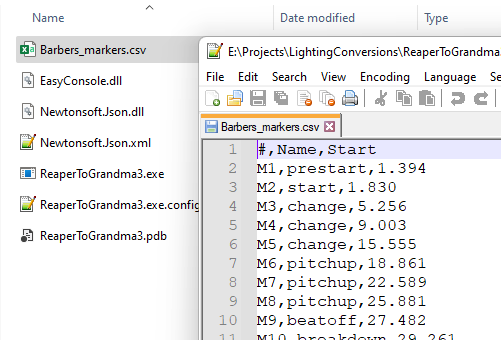

Run ReaperToGrandma3.exe

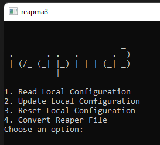

1. Read Local Configuration - this will show you the current configuration settings. 
2. Update Local Configuration - this will allow you to update the configuration settings.
3. Reset Local Configuration - this will wipe the configuration and reset it back to defaults.
4. Convert Reaper File - this will convert the CSV file to a Grandma3 macro file.

### Editing the configuration
You can edit the configuration two ways. 

1. By using the console application, selection option 2. Update Local Configuration.

2. Editing the LocalConfig.txt file. (this file is created on first run of the application). 

The configuration options are: 

```
{
    "SequenceNo": "10",
    "Executor": "1.215",
    "Datapools": "C:\\\\ProgramData\\\\MALightingTechnology\\\\gma3_library\\\\datapools",
    "TimecodeNo": "1"
}
```

SequenceNo - The sequence number you want the cues to be created in.

Executor - The executor the sequence will be assigned to

Datapools - The location of the datapools folder in Grandma3 (you can output to anywhere)

TimecodeNo - The timecode number you want to use.

If you mess up the configuration, you can reset it by selecting option 3. Reset Local Configuration or by deleting the LocalConfig.txt file.

### Running the conversion

Once you have the configuration set, select option 4. Convert Reaper File.

If you have multiple CSV files in the directory, reapma3 will ask you which file you want to convert.

Select the file you want to convert, and press enter.

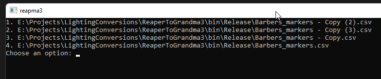

reapma3 will then create the files in the folders you specified in the configuration, or by default the shared grandma3 folder.

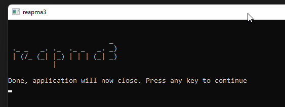

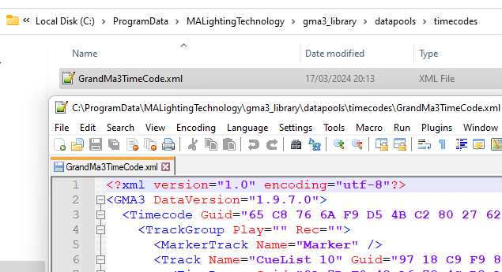
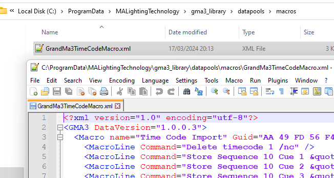


## Grandma3

We need to import the Marco into Grandma3.


Select the menu cog

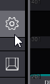

Import/Export

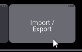

Macros

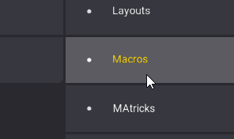

Scroll to find the Marco in the list, select and click import. 

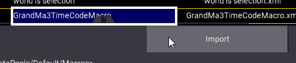

The Macro pool has a new macro called "Time Code Import". Click the Marco. This will import the timecode, create the cues in the sequence and assign the sequence to the executor.

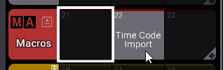


The timecode and sequence is now created in Grandma3.

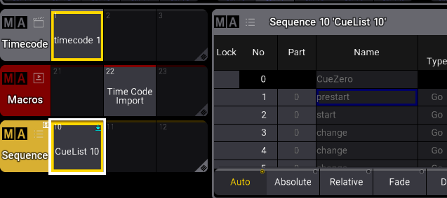
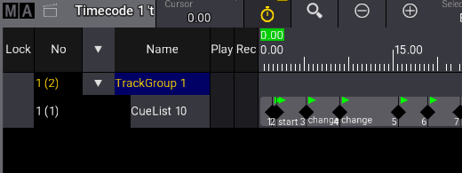


### enjoy

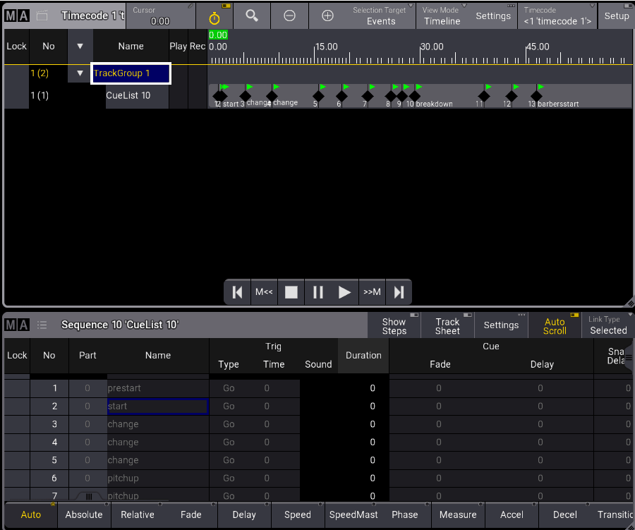


