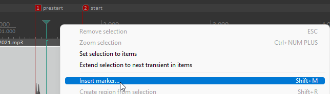
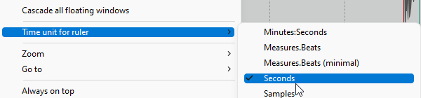
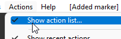
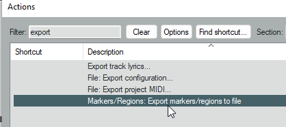
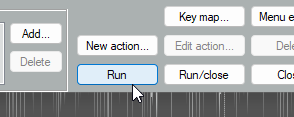

# Reaper To Grandma3

Project which converts markers from Reaper to Grandma3 timecode and creates an supporitng macro. 
The macro will import the timecode and generate the cues within a sequence.

# Important

This project is a very basic 'version 1' which does not have any error handling or validation. It is very much a work in progress.

# Libability

This project is provided as is. I accept no liability for any damage or loss of data caused by the use of this software.

# Prerequisites
Reaper

Grandma3 onPC

.NET Framework 4.8

# Getting Started

## Reaper

In Reaper you need to create a marker for each cue you want to import into Grandma3. The marker name should be the timecode you want the cue to be triggered at.

Once you have created all your markers, you need to export them as a text file.
reapma3 is expecting the time to be in seconds, therefore you must change the Time unit to seconds before export. 

To export the markers, goto the Action menu, show actions list and select "Markers/Regions: Export markers to file". Run the action and save the CSV file.

## reapma3

